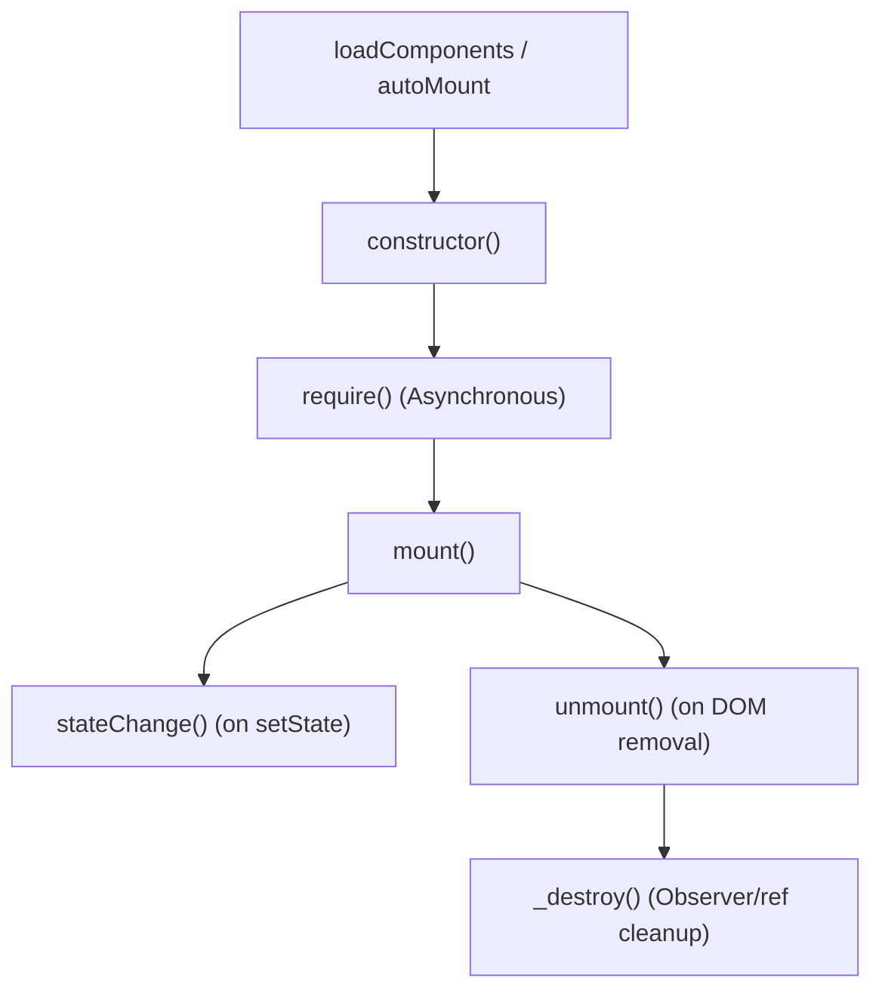

# Gia

A performance-first, ultra-lightweight JavaScript framework (~5KB gzipped) for creating **Islands of Interactivity** on server-rendered (WordPress, Django, Rails, Laravel, Astro) or static websites. It provides the clean lifecycle, state management, and declarative event binding of modern SPA frameworks without the heavy bundle size or Virtual DOM overhead.

[](LICENSE)
[-blue?style=flat-square)](dist/gia.full.umd.js)

*Note: This is an optimized fork of the original Gia framework. It contains numerous performance enhancements, custom examples, and robust memory management.*

---

### Why Gia?

1. **Ultra-Lightweight & Fast**: Practically invisible on the network. Built using native Web APIs (like `EventTarget` for the global event bus) and optimized to minimize memory allocations.
2. **Solves "Vanilla JS Spaghetti"**: Traditional multi-page sites struggle with messy event listeners and memory leaks. Gia's strict lifecycle (`mount`, `require`, `unmount`) ensures automatic cleanup when elements leave the DOM.
3. **Zero-GC Hot Paths**: Hand-optimized to avoid garbage collection spikes and layout thrashing. Perfect for high-frequency events (scrolling, resizing, drag-and-drop, and interactive canvases).
4. **Built-in DX Features**: Comes with pre-indexed references (`data-ref`), declarative event mapping (`data-action`), unified observers, and asynchronous script/style loading out-of-the-box.

---

## Table of Contents

- [Installation](#installation)
- [Quick Start](#quick-start)
- [Component Lifecycle](#component-lifecycle)
- [Core Concepts](#core-concepts)
  - [The Ref System (`this.ref`)](#the-ref-system-thisref)
  - [State & Reactivity (`this.setState`)](#state--reactivity-thissetstate)
  - [Centralized Observers](#centralized-observers)
  - [On-Demand Dependencies (`require`)](#on-demand-dependencies-require)
  - [Global Eventbus](#global-eventbus)
- [Quality of Life Features](#quality-of-life-features)
  - [Component Options (`data-options`)](#component-options-data-options)
  - [Event Binding (`data-action`)](#event-binding-data-action)
  - [Auto-Mounting](#auto-mounting)
- [Global Configuration](#global-configuration)
- [API Reference](#api-reference)
- [Performance Optimizations](#performance-optimizations)
- [Interactive Examples](#interactive-examples)
- [Integration with Swup](#integration-with-swup)

---

## Installation & Build Variants

Gia is compiled into three highly optimized build variants depending on the features you need. Load the UMD builds directly via script tag, or import the ESM (`.mjs`) builds via a bundler.

| Build Variant | Description | UMD Gzip Size | File |
| --- | --- | --- | --- |
| **Full Build** | Includes all framework features, async `require()`, global observers, and the EventBus. | ~5.1 KB | `dist/gia.full.umd.js` |
| **Mini Build** | Drops `autoMount` MutationObserver logic and `data-action` auto-binding parsing. | ~4.6 KB | `dist/gia.mini.umd.js` |
| **Nano Build** | The absolute bare minimum. Drops EventBus, global observers (scroll/resize), JSON options parsing, state-to-attribute syncing, and async script loading. Just the core class and ref engine. | ~2.6 KB | `dist/gia.nano.umd.js` |

```html
<!-- Example: Loading the full build -->
<script src="./dist/gia.full.umd.js"></script>
```

After loading the script, your components can be registered using `gia.register(ComponentClass)` to make them discoverable globally.

---

## Quick Start

### 1. Define the HTML markup

Mark the root element with `data-component` and assign `data-ref` to any child elements you need to interact with.

```html
<div class="counter" data-component="Counter">
  <button class="button" data-ref="decrementBtn" aria-label="Decrease">-</button>
  <output class="display" data-ref="display">0</output>
  <button class="button" data-ref="incrementBtn" aria-label="Increase">+</button>
</div>
```

### 2. Implement the component

```javascript
import { Component } from "gia";

class Counter extends Component {
  constructor(element) {
    super(element);
    
    this.ref = {
      display: null,
      incrementBtn: null,
      decrementBtn: null
    };

    this.setState({ count: 0 });
  }

  mount() {
    // Component methods are automatically bound to `this`
    this.ref.incrementBtn.addEventListener("click", this.increment);
    this.ref.decrementBtn.addEventListener("click", this.decrement);

    // Initial render
    this.ref.display.textContent = this.state.count;
  }

  increment() {
    this.setState({ count: this.state.count + 1 });
  }

  decrement() {
    this.setState({ count: this.state.count - 1 });
  }

  // Automatically called in the next animation frame when state changes
  stateChange(changes) {
    if ("count" in changes) {
      this.ref.display.textContent = this.state.count;
    }
  }
}
```

### 3. Load and register your components

```javascript
import { loadComponents } from "gia";

const components = {
  Counter
};

// Auto-discovers and mounts matching components inside the document
loadComponents(components);
```

---

## Component Lifecycle



Gia components follow a strict lifecycle designed to optimize rendering performance and prevent memory leaks:

1. **`constructor(element)`**: Sets up defaults, defines `this.ref` targets, and sets initial state.
2. **`require()` (Async)**: *Available on `Component` (not `BaseComponent`)*. Performs on-demand script or style loading. Mount is deferred until this resolves.
3. **`mount()`**: Executes after constructor and dependencies are resolved. Bind custom events, construct third-party libraries, and bootstrap interactions here.
4. **`stateChange(changes)`**: Invoked inside `requestAnimationFrame` when state values change.
5. **`unmount()`**: Runs when the component is destroyed (e.g. element removed from DOM). Clean up custom event listeners, timelines, or third-party instances here.
6. **`_destroy()`**: Internal lifecycle step. Automatically unsubscribes all unified observers and clears elements from memory.

---

## Core Concepts

### The Ref System (`this.ref`)

Instead of writing repetitive `document.querySelector` statements, Gia pre-indexes elements containing `data-ref` inside your component's root context.

#### Configuration Rules

- Set reference keys to `null` to resolve to a **single element**.
- Set reference keys to `[]` to resolve to an **array of elements**.
- Set `this.ref` to an empty object `{}` to automatically grab all refs as arrays.

```html
<div data-component="Gallery">
  <button data-ref="prev">Previous</button>
  <button data-ref="next">Next</button>
  <div data-ref="slides">Slide 1</div>
  <div data-ref="slides">Slide 2</div>
</div>
```

```javascript
class Gallery extends Component {
  constructor(element) {
    super(element);
    this.ref = {
      prev: null,  // Single HTMLElement
      next: null,  // Single HTMLElement
      slides: []   // Array of HTMLElements
    };
  }
}
```

> [!TIP]
> **Ref Namespacing**: If components overlap, you can namespace references to keep contexts separate: `<div data-ref="MyComponent:nestedItem">`.

---

### State & Reactivity (`this.setState`)

State should be mutated using `this.setState()`. When state properties change, Gia queues a callback to `stateChange()` in the next animation frame, preventing layout thrashing.

```javascript
this.setState({ activeTab: 2 });
```

#### State-to-Attribute Auto-binding

Gia automatically serializes primitive state properties (`boolean` and `string` types) into `data-` attributes on the root element. CamelCase state keys are translated to kebab-case:

- `isOpen: true` ➔ `data-is-open="true"`
- `status: "loading"` ➔ `data-status="loading"`

This allows you to control component styling entirely through CSS, removing the need for verbose class-toggling code:

```css
[data-component="Sidebar"] {
  transform: translateX(-100%);
  transition: transform 0.3s cubic-bezier(0.16, 1, 0.3, 1);
}
[data-component="Sidebar"][data-is-open="true"] {
  transform: translateX(0);
}
```

---

### Centralized Observers

Instantiating multiple `IntersectionObserver` or `ResizeObserver` instances can lead to severe browser performance bottlenecks. Gia shares centralized, global observer instances and window listeners across all components. It also handles automatic unsubscription during the `unmount` phase, ensuring zero memory leaks.

Gia provides four primary observer APIs built directly into `BaseComponent`:

#### 1. Intersection (`observeIntersection`)
Instead of each component creating its own `IntersectionObserver`, Gia groups elements by their observer options (like `threshold` and `rootMargin`) and monitors them using a shared, global observer. 
*   **Usage**: `this.observeIntersection(element, callback, options)`
*   **Best for**: Lazy-loading images, scroll-triggered animations (like `Reveal`), and pausing heavy tasks (like canvas physics) when out of view.

#### 2. Element Resize (`observeResize`)
Monitors changes to an element's dimensions using a single, globally shared `ResizeObserver`.
*   **Usage**: `this.observeResize(element, callback)`
*   **Best for**: Responsive components, canvas resizing, and custom text-scaling utilities (like `TextFit`).

#### 3. Global Scroll (`observeScroll`)
Attaches to a single centralized window scroll listener. Instead of forcing the browser to synchronously recalculate layout by reading `window.scrollY` inside your callback, Gia passes a pre-calculated `payload` containing the current scroll position and velocity.
*   **Usage**: `this.observeScroll((payload) => console.log(payload.scroll, payload.velocity))`
*   **Bonus**: If the popular [Lenis](https://lenis.studiofreight.com/) smooth scroll library is detected globally (`window.lenis`), Gia automatically hooks into its optimized `requestAnimationFrame` scroll tick instead of the native DOM scroll event.

#### 4. Window Resize (`observeWindowResize`)
Attaches to a single centralized window resize listener (or `orientationchange` on mobile browsers) to prevent multiple components from binding heavy resize events simultaneously.
*   **Usage**: `this.observeWindowResize((payload) => console.log(payload.width, payload.height))`

**Example implementation:**

```javascript
class TrackingComponent extends Component {
  mount() {
    this.observeIntersection(this.element, this.handleIntersection, { threshold: 0.5 });
    this.observeResize(this.element, this.handleElementResize);
    this.observeScroll(this.handleScroll);
    this.observeWindowResize(this.handleWindowResize);
  }

  handleIntersection([entry]) {
    if (entry.isIntersecting) {
      entry.target.classList.add("in-view");
    }
  }

  handleElementResize([entry]) {
    console.log("Element width:", entry.contentRect.width);
  }

  handleScroll(payload) {
    // Safely read from payload to avoid layout thrashing!
    this.element.style.transform = `translateY(${payload.scroll * 0.5}px)`;
  }

  handleWindowResize(payload) {
    console.log("Window bounds:", payload.width, payload.height);
  }
}
```

---

### On-Demand Dependencies (`require`)

Keep your initial bundle size tiny by lazy-loading heavy third-party dependencies only when a component that actually needs them is present on the page. 

To use `loadScript` and `loadStyle`, you must place the `<script>` and `<link>` tags in your HTML with `data-src` and `data-href` attributes instead of standard `src`/`href`. Gia locates the tag by its `id`, safely triggers the network request, and returns a Promise. 

Gia handles concurrency automatically: if five components request the same script simultaneously, Gia only downloads it once and resolves all component promises when it finishes.

```html
<!-- Place these in your <head> or at the bottom of the body -->
<link id="floating-ui-css" rel="stylesheet" data-href="/path/to/floating-ui.css">
<script id="floating-ui-js" data-src="/path/to/floating-ui.js"></script>
```

```javascript
class Tooltip extends Component {
  async require() {
    // loadScript(scriptId, expectedGlobalVariable)
    // loadStyle(styleId)
    await Promise.all([
      this.loadScript("floating-ui-js", "FloatingUI"),
      this.loadStyle("floating-ui-css")
    ]);
  }

  mount() {
    // Dependencies are fully loaded and injected before mount() runs
    console.log(window.FloatingUI);
  }
}
```

---

### Global Eventbus

Decouple your components by communicating through a global, native `EventTarget`-powered event bus.

```javascript
import { eventbus } from "gia";

// Component A (Emitter)
eventbus.emit("productAdded", { id: 101, name: "Premium Widget" });

// Component B (Receiver)
eventbus.on("productAdded", (data) => {
  console.log(`Updating cart with product: ${data.name}`);
});
```

---

## Quality of Life Features

### Component Options (`data-options`)

You can pass configuration options directly from HTML into your component via the `data-options` attribute. The attribute must contain valid JSON. Gia parses this and merges it with default options defined in your constructor.

```html
<div data-component="Slider" data-options='{"speed": 500, "loop": true}'>
    <!-- Slider content -->
</div>
```

```javascript
class Slider extends Component {
    constructor(element) {
        super(element);

        // Define defaults and merge with `data-options`
        this.options = {
            speed: 300,
            loop: false
        };
    }

    mount() {
        console.log(this.options.speed); // 500
        console.log(this.options.loop);  // true
    }
}
```

---

### Event Binding (`data-action`)

By setting `config.set("autoBindActions", true)`, Gia parses `data-action` attributes and automatically binds matching component methods as event listeners, eliminating the need to manually attach and clean up standard event listeners in `mount()`.

**Format**: `data-action="eventName->methodName"` (separate multiple events with spaces).

```html
<div data-component="InteractiveCard">
  <div data-action="mouseenter->handleEnter mouseleave->handleLeave">Hover Me</div>
  <button data-action="click->handleClick">Click Me</button>
</div>
```

```javascript
class InteractiveCard extends Component {
  handleEnter(event) {
    event.currentTarget.classList.add("hovered");
  }
  handleLeave(event) {
    event.currentTarget.classList.remove("hovered");
  }
  handleClick(event) {
    console.log("Card clicked!", event.currentTarget);
  }
}
```

> [!IMPORTANT]
> **Best Practice**: Always use `event.currentTarget` instead of `event.target` in event handlers. `event.currentTarget` is guaranteed to point to the element containing the `data-action` attribute, preventing issues when users click on nested elements (such as icons or text spans).

---

### Auto-Mounting

By default, components are loaded manually with `loadComponents(components)`. By enabling `config.set("autoMountComponents", true)`, Gia uses a `MutationObserver` to automatically detect newly injected HTML and mount or unmount instances automatically. 

```javascript
import { config, loadComponents } from "gia";

config.set("autoMountComponents", true);
loadComponents({ MyComponent });

// Anytime `<div data-component="MyComponent">` is added to the DOM, it mounts automatically.
// Example: document.body.innerHTML += '<div data-component="MyComponent">Dynamically Injected</div>';
```

---

## Global Configuration

Customize the framework's behavior using the global `config` object:

```javascript
import { config } from "gia";

// Toggle console logging and warning messages
config.set("log", true);

// Customize data attribute prefix (e.g. 'g' searches for 'g-component' instead of 'data-component')
config.set("attrPrefix", "data");

// Enable MutationObserver to automatically mount and unmount components on DOM tree changes
config.set("autoMountComponents", true);

// Toggle automatic binding of data-action attributes
config.set("autoBindActions", true);
```

---

## API Reference

### Global Exports

- **`loadComponents(components, context)`**: Discovers and mounts components under the given context.
- **`createInstance(element, componentName, ComponentClass, options)`**: Manually attaches a component to a DOM element.
- **`destroyInstance(element)`**: Dismantles a component instance, triggering `unmount` and cleaning memory references.
- **`removeComponents(context)`**: Destroys and cleans up all component instances inside the target context.
- **`getComponentFromElement(element)`**: Retrieves the active component instance associated with a DOM node.
- **`eventbus`**: Unified `EventTarget`-based event emitter.

### BaseComponent API

- **`setState(changes)`**: Batches state modifications and queues a DOM re-render in the next animation frame.
- **`observeIntersection(element, callback, options)`** / **`unobserveIntersection(element, callback)`**: Subscribes/unsubscribes to a shared IntersectionObserver.
- **`observeResize(element, callback)`** / **`unobserveResize(element, callback)`**: Subscribes/unsubscribes to a shared ResizeObserver.
- **`observeScroll(callback)`** / **`unobserveScroll(callback)`**: Subscribes/unsubscribes to a single, optimized window scroll listener.
- **`observeWindowResize(callback)`** / **`unobserveWindowResize(callback)`**: Subscribes/unsubscribes to a single window resize listener.
- **`loadScript(scriptId, globalVarName)`**: Concurrent-safe, cached dynamic script loader.
- **`loadStyle(styleId)`**: Concurrent-safe, cached dynamic stylesheet loader.

---

## Performance Optimizations

To run smooth animations at 60fps, even on low-end mobile devices, this fork implements several optimizations designed to eliminate garbage collection (GC) pauses and prevent layout thrashing:

- **Closure Avoidance**: Observer callbacks are hoisted and context-bound with `thisArg` or properties instead of allocating new anonymous functions on the fly.
- **Reused Payloads**: High-frequency event payloads (like window scroll position and resize dimensions) are allocated once and updated in-place.
- **Iterator Suppression**: Replaced `.forEach()`, `.map()`, `.filter()`, and `for...of` iterators with classic `for` loops in hot code paths, avoiding short-lived iterator objects.
- **Empty Object Checks**: Uses fast-failing `for...in` loops instead of instantiating temporary arrays via `Object.keys()`.
- **Reference Disconnection**: The `unmount` phase clears references on both Javascript classes and DOM elements, preventing memory leaks and allowing prompt Garbage Collection.

---

## Interactive Examples

A comprehensive suite of examples demonstrating best practices is available. You can view the [Live Demo](https://alexander-neumann-webdesign.github.io/gia/demo/) or inspect their source code.

### Navigation & Layout
- **[Accordion](examples/Accordion.js)**: Semantic, accessible accordion utilizing `<details>`/`<summary>`. Manages state to auto-close sibling panels and syncs with the URL hash.
- **[Header](examples/Header.js)**: A scroll-aware site header caching layout dimensions to apply CSS transforms via `requestAnimationFrame` without layout thrashing.
- **[OffCanvasMenu](examples/OffCanvasMenu.js)**: A slide-out navigation menu demonstrating state-based class toggling, inert trapping for accessibility, and click-outside handling.
- **[Tabs](examples/Tabs.js)**: A classic tabbed interface relying on Gia's state management to toggle active views and ARIA attributes, complete with URL syncing.

### UI Elements
- **[ClipboardCopy](examples/ClipboardCopy.js)**: A utility component that copies text to the clipboard and provides temporary UI feedback based on state transitions.
- **[CustomCursor](examples/CustomCursor.js)**: A performant custom cursor replacement featuring frame-rate independent exponential smoothing for magnetic snapping and morphing.
- **[Modal](examples/Modal.js)**: An accessible dialog leveraging the native `<dialog>` element. Supports complex triggering, click-outside logic, and URL hash syncing.
- **[ThemeToggle](examples/ThemeToggle.js)**: A dark/light mode toggle switch interacting with `localStorage` and mutating global document state.
- **[Tooltip](examples/Tooltip.js)**: A robust tooltip component asynchronously importing the Floating UI library via `require()` for collision-aware positioning.

### Media & Galleries
- **[ImageComparison](examples/ImageComparison.js)**: A before/after comparison component using a visually hidden range slider to dynamically update a `clip-path` mask via CSS variables.
- **[ImageHolder](examples/ImageHolder.js)**: A highly optimized image component providing smooth parallax, viewport entrance tracking, and dynamic `sizes` calculations.
- **[LightboxGallery](examples/LightboxGallery.js)**: A fully-featured gallery demonstrating dynamic script loading by pulling in the PhotoSwipe library only when actually clicked.
- **[Slider](examples/Slider.js)**: A swipeable, touch-friendly content slider demonstrating advanced pointer event handling and batched hardware-accelerated CSS transforms.
- **[VideoHolder](examples/VideoHolder.js)**: A lazy-loading video component that automatically pauses playback when scrolled out of view to save system resources.

### Scroll & Visual Effects
- **[Marquee](examples/Marquee.js)**: An infinite-scrolling marquee that automatically clones elements and handles continuous, sub-pixel perfect `requestAnimationFrame` updates.
- **[Reveal](examples/Reveal.js)**: A stagger-ready scroll-reveal component leveraging the globally shared Intersection Observer to handle hundreds of elements without memory leaks.
- **[SplitText](examples/SplitText.js)**: A specialized typography component that intelligently divides text into lines, words, and characters using the native `Intl.Segmenter` API.
- **[TextFit](examples/TextFit.js)**: A typography utility integrating the `fitty` library to seamlessly scale text to fit its container perfectly.

### Forms & Selection
- **[Form](examples/Form.js)**: An AJAX-powered form component with built-in HTML5 validation handling, animated loading spinners, and state-driven success/error messaging.
- **[MultipleSelect](examples/MultipleSelect.js)**: A wrapper for `multiple-select-vanilla` dynamically loading its dependencies and exposing standard value getters/setters.
- **[RangeSlider](examples/RangeSlider.js)**: A flexible range slider wrapping the `noUiSlider` library, implementing two-way data binding with native hidden inputs.

### Complex Interactivity
- **[FilterableList](examples/FilterableList.js)**: A filtering and sorting component synchronizing state with URL parameters and utilizing the modern View Transitions API.
- **[OpenStreetMap](examples/OpenStreetMap.js)**: A Leaflet-based interactive map component asynchronously loading dependencies to plot markers dynamically.
- **[MatterPhysicsBackground](examples/MatterPhysicsBackground.js)**: An interactive physics-based canvas utilizing Matter.js, including automatic pausing via IntersectionObserver to save CPU.
- **[PongGame](examples/PongGame.js)**: A complete, playable Pong game running a custom loop within `requestAnimationFrame`, demonstrating canvas drawing and input handling.
- **[TodoApp](examples/TodoApp.js)**: A fully-featured todo application highlighting complex state arrays, local storage syncing, and accessible ARIA live regions.

---

## Integration with Swup

Gia integrates perfectly with page transition libraries like [Swup](https://swup.js.org/).

### Setup elegant listeners to mount and destroy components on page transitions:

```javascript
import { loadComponents, removeComponents } from "gia";
import Swup from "swup";
import components from "./components"; // Your component registry

const containerSelector = "#swup-container";
const swup = new Swup({ containers: [containerSelector] });

// Helper functions scoped to the current main container
const mount = () => loadComponents(components, document.querySelector(containerSelector));
const unmount = () => removeComponents(document.querySelector(containerSelector));

// Initial page load
mount();

// Hook into Swup's lifecycle events
swup.hooks.before("content:replace", unmount);
swup.hooks.on("content:replace", mount);
```

---

## License

Gia is open-source software licensed under the [MIT License](LICENSE).

---
*Maintained and optimized by [Alexander Neumann Webdesign](https://alexander-neumann.site).*
